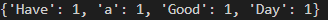

# command-line-arguments-to-count-word
## AIM:
To write a python program for getting the word count from the contents of a file using command line arguments.
## EQUIPEMENT'S REQUIRED: 
PC
Anaconda - Python 3.7
## ALGORITHM: 
### Step 1:

Get the file name as the input from the user

### Step 2: 
 
 Open the file using the withopen function

### Step 3: 

Use for loop and split function 

### Step 4:  

Print the program

### Step 5: 

End the program


## PROGRAM:
```
Developed by  : Sakthiswar S
Ref No : 22008587
```
```python

import sys
count = {}
with open(sys.argv[1],'r') as f:
    for line in f :
        for word in line.split():
            if word not in count:
                count[word] = 1 
            else:
                count[word] += 1 
print(count)
f.close()
```

### OUTPUT:



## RESULT:
Thus the program is written to find the word count from the contents of a file using command line arguments.
